# JianziNote

## 简介

古琴谱减字自动生成程序，使用基本减字通过组合得到新的减字。

基本理念：

- 使用自定义运算符进行减字组合；同时提供自然表述以简化常用减字的输入；
- 减字名称使用utf8编码的中文字符，无需额外记忆符号；
- 根据汉字框架结构特点均匀横画间隔，使减字间架比例自然；
- 自动计算笔画粗细权重，使笔画粗细自然；
- 配合不同的Styler可实现不同风格的字形输出；
- 输出矢量描述，可开发不同输出端提供不同平台的功能包或插件，如LaTeX、Lilypond等；

## 使用

### 减字库

`Jianzi.hpp`使用SQLite储存已定义的减字名称和框架信息，即为减字库。只有框架信息的减字库无法直接使用，需要配合减字风格库。`SkeletonStyler.hpp`为仅将关键控制点进行连线的风格库。

JianziNote项目内部统一使用以左上角为(0,0)、右下角为(1,1)的归一化坐标。

### 减字风格

`JianziStyler.hpp`定义了基本的减字风格所需的信息，`StylerFromDb.hpp`则为使用SQLite储存减字信息的Styler实现，即减字风格库。

`bin`目录内提供基于“思源宋体”旧字形风格开发的减字库，可直接使用。出于外观风格统一等方面考虑，并未开放该减字库的开发工具，有添加减字的需求可提issue。目前支持的基础减字及预览如下：

#### 数字

| 一                                              | 二                                              | 三                                              | 四                                              | 五                                              | 六                                              | 七                                              | 八                                              | 九                                              | 十                                              | 外                                              | 半                                              |
| ---------------------------------------------- | ---------------------------------------------- | ---------------------------------------------- | ---------------------------------------------- | ---------------------------------------------- | ---------------------------------------------- | ---------------------------------------------- | ---------------------------------------------- | ---------------------------------------------- | ---------------------------------------------- | ---------------------------------------------- | ---------------------------------------------- |
| 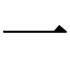 | 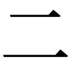 | 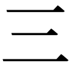 | 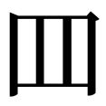 | 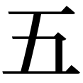 | 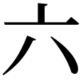 | 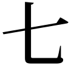 | 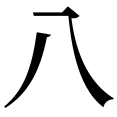 | 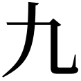 | 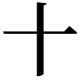 | 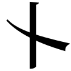 | 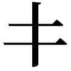 |

#### 左手

| 大                                              | 食                                              | 中                                              | 名                                              | 跪                                              | 散                                              |
| ---------------------------------------------- | ---------------------------------------------- | ---------------------------------------------- | ---------------------------------------------- | ---------------------------------------------- | ---------------------------------------------- |
| 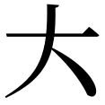 | 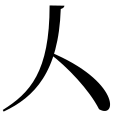 | 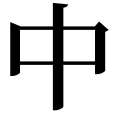 | 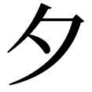 | 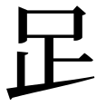 |  |

#### 单弦指法

| 擘                                              | 托                                              | 抹                                              | 挑                                              | 勾                                              | 剔                                              | 打                                              | 摘                                              |
| ---------------------------------------------- | ---------------------------------------------- | ---------------------------------------------- | ---------------------------------------------- | ---------------------------------------------- | ---------------------------------------------- | ---------------------------------------------- | ---------------------------------------------- |
| 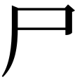 |  | 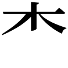 | 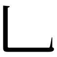 | 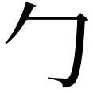 | 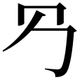 |  |  |

| 抹挑                                               | 勾剔                                               | 打摘                                               | 按                                              | 轮                                              | 涓                                              | 叠                                              | 锁                                              | 罨                                              |
| ------------------------------------------------ | ------------------------------------------------ | ------------------------------------------------ | ---------------------------------------------- | ---------------------------------------------- | ---------------------------------------------- | ---------------------------------------------- | ---------------------------------------------- | ---------------------------------------------- |
| 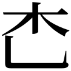 | 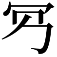 | 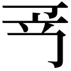 |  |  | 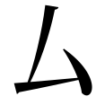 |  | 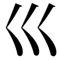 | 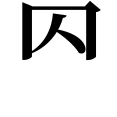 |

#### 多弦指法

| 拨                                              | 剌                                              | 拨剌                                               | 撮                                              | 弹                                              | 滚                                              | 拂                                              | 至                                              | 历                                              |
| ---------------------------------------------- | ---------------------------------------------- | ------------------------------------------------ | ---------------------------------------------- | ---------------------------------------------- | ---------------------------------------------- | ---------------------------------------------- | ---------------------------------------------- | ---------------------------------------------- |
| 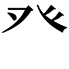 | 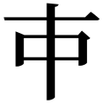 | 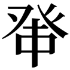 | 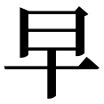 | 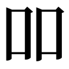 | 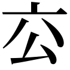 | 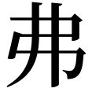 | 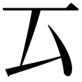 | 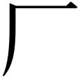 |

#### 修饰

| 绰                                              | 注                                              | 泛                                              | 反                                              | 急                                              | 就                                              | 掐                                              |
| ---------------------------------------------- | ---------------------------------------------- | ---------------------------------------------- | ---------------------------------------------- | ---------------------------------------------- | ---------------------------------------------- | ---------------------------------------------- |
| 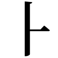 | 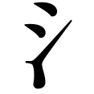 | 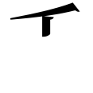 | 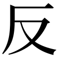 | 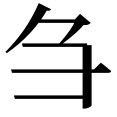 | 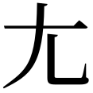 | 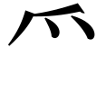 |

#### 其他

| 背                                              | 不动                                               | 次                                              | 从                                              | 打圆                                               | 带                                              | 荡                                              | 逗                                              | 度                                              | 放                                              |
| ---------------------------------------------- | ------------------------------------------------ | ---------------------------------------------- | ---------------------------------------------- | ------------------------------------------------ | ---------------------------------------------- | ---------------------------------------------- | ---------------------------------------------- | ---------------------------------------------- | ---------------------------------------------- |
| 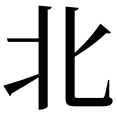 | 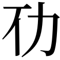 |  | 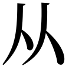 |  | 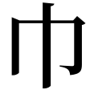 | 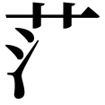 | 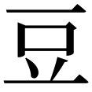 |  |  |

| 分开                                               | 伏                                              | 复                                              | 合                                              | 浒                                              | 缓                                              | 唤                                              | 节                                              | 进                                              | 连                                              |
| ------------------------------------------------ | ---------------------------------------------- | ---------------------------------------------- | ---------------------------------------------- | ---------------------------------------------- | ---------------------------------------------- | ---------------------------------------------- | ---------------------------------------------- | ---------------------------------------------- | ---------------------------------------------- |
|  |  |  |  |  |  |  |  |  |  |

| 落指                                               | 慢                                              | 猱                                              | 撇                                              | 起                                              | 轻                                              | 曲                                              | 如                                              | 入                                              | 软                                              |
| ------------------------------------------------ | ---------------------------------------------- | ---------------------------------------------- | ---------------------------------------------- | ---------------------------------------------- | ---------------------------------------------- | ---------------------------------------------- | ---------------------------------------------- | ---------------------------------------------- | ---------------------------------------------- |
|  |  |  |  |  |  |  |  |  |  |

| 上                                              | 少                                              | 少息                                               | 声                                              | 双                                              | 索铃                                               | 淌                                              | 同                                              | 头                                              | 推出                                               |
| ---------------------------------------------- | ---------------------------------------------- | ------------------------------------------------ | ---------------------------------------------- | ---------------------------------------------- | ------------------------------------------------ | ---------------------------------------------- | ---------------------------------------------- | ---------------------------------------------- | ------------------------------------------------ |
|  |  |  |  |  |  |  |  |  |  |

| 退                                              | 往来                                               | 细                                              | 下                                              | 虚                                              | 许                                              | 音                                              | 吟                                              | 应合                                               | 游                                              |
| ---------------------------------------------- | ------------------------------------------------ | ---------------------------------------------- | ---------------------------------------------- | ---------------------------------------------- | ---------------------------------------------- | ---------------------------------------------- | ---------------------------------------------- | ------------------------------------------------ | ---------------------------------------------- |
|  |  |  |  |  |  |  |  |  |  |

| 又                                              | 圆搂                                               | 再                                              | 长                                              | 止                                              | 指                                              | 终                                              | 抓                                              | 撞                                              | 作                                              |
| ---------------------------------------------- | ------------------------------------------------ | ---------------------------------------------- | ---------------------------------------------- | ---------------------------------------------- | ---------------------------------------------- | ---------------------------------------------- | ---------------------------------------------- | ---------------------------------------------- | ---------------------------------------------- |
|  |  |  |  |  |  |  |  |  |  |

| 左反复                                                | 右反复                                                |
| -------------------------------------------------- | -------------------------------------------------- |
|  |  |

其中也支持一些常用的别称，列表如下：

| 减字  | 别称  |
| --- | --- |
| 擘   | 劈   |
| 掐   | 搯   |
| 剔   | 踢   |
| 拨   | 泼   |

在没有特殊规则的情况下，减字将以上下堆叠的方式组合，因此如“泛起”、“泛止”、“掐起”、“双弹”等减字无需特别定义即可输入。

减字库也提供了一些常用但需要特别运算规则的固定减字组合，以减少输入复杂度（见“算式”一节），列表如下：

| 组合    | 表达式             |
| ----- | --------------- |
| 掐起    | `(掐/起)`         |
| 掐撮三声  | `(掐/撮*(声\|三))`  |
| 掐拨剌三声 | `(掐/拨剌*(声\|三))` |
| 同声    | `(同*声)`         |
| 同起    | `(同*起)`         |
| 虚罨    | `(虚*罨)`         |
| 游吟    | `(游*吟)`         |
| 游猱    | `(游*猱)`         |
| 放合    | `(放&合)`         |

### 基本用法——文字表述

常用减字可通过文字表述直接得到。文字表述仅使用减字库当中有的减字名称，按照从左到右、从上到下的方式排列，不加额外字符。示例如下：

| 文字表述      | 结果                                                         |
| --------- | ---------------------------------------------------------- |
| `大九挑七`    |        |
| `名十八注抹五`  |    |
| `中九绰勾剔一`  |    |
| `拨大七六七散六` |  |
| `撮名十八三散五` |  |
| `泛撮六一`    |        |
| `拨剌一`     |          |

文字表述使用贪婪匹配，在算法库内部按照一定规律转化成为算式，见“算式”一节。文字表述模式可基本满足明末以后的琴谱减字输入需求。更早的琴谱由于记谱方式尚未足够统一，由于减字组合位置不同而产生的差异可通过算式模式解决，而基本减字的写法不同产生的差异只能通过切换减字库解决。

### 高阶用法——算式

使用基本减字加运算符形成算式，可以任意组合减字，实现复杂的效果。在最外层使用一对圆括号来指示使用算式；而算式当中也可以通过一对单引号来使用字符串，以简化部分输入。示例如下：

| 表达式                         | 结果                                                             |
| --------------------------- | -------------------------------------------------------------- |
| `(大&九^挑*七)`                 |            |
| `((名&(十/一))/(中&食)/拂/滚/一/二)` |  |
| `(食<(中&名)^打*五)`             |          |
| `(右反复*'大九挑七')`              |      |

同级运算符按从左到右进行运算。运算符优先级列表及功能描述如下：

| 优先级 | 运算符  | 功能描述                                                             |
| --- | ---- | ---------------------------------------------------------------- |
| 0   | `()` | 括号，用于调整运算顺序，具有最高优先级                                              |
| 0   | `'`  | 单引号，用于从算式模式进入文字表述模式，简化输入                                         |
| 4   | `*`  | 将后一个减字置于前一个减字内；如果前一个减字并无内置空间，则效果同`/`运算符。                         |
| 3   | `&`  | 将两个减字左右均分。                                                       |
| 3   | `<`  | 将两个减字按0.3:0.7比例左右缩放。基本用于指法“注”。                                   |
| 3   | `/`  | 将两个减字根据各自所占的纵向间隔比例缩放。                                            |
| 2   | `\|` | 用于将两个减字左右均分，且中间留出一竖的空间。用在中间带竖的双弦指法的下半部分，如“撮”、“剌”等减字。             |
| 1   | `^`  | 如果前一个减字纵向间隔比例小于后一个，则效果同`/`；否则，将两个减字上下均分。用于调整减字重心，一般在减字的左右手分界处使用。 |

### 输出描述

`JianziStyler.hpp`定义了输出的通用矢量描述方式，即以`MoveTo`、`LineTo`、`QuadTo`、`CubicTo`和`Close`为关键字的列表，以及对应的点坐标列表。此描述方式方便对接到Cairo、Skia、LaTeX、Lilypond等不同的应用当中。

具体实现示例见Jianzi2LaTeX和Jianzi2Lilypond等子项目。

### 库使用

```cpp
#include <Jianzi.hpp>
#include <StylerFromDb.hpp>
#include <string>

// 假定的某个绘制矢量路径的renderer
#include <SomeRenderer.hpp>

using namespace qin;

// 假定的减字库路径
std::string db_file = "JianziNote.db";

// 加载减字信息
Jianzi::OpenDb(db_file.c_str());

// 读取styler列表
auto styler_names = StylerFromDb::GetStylerList(db_file);
// 加载第一个styler
StylerFromDb styler;
styler.Load(db_file, styler_names[0]);

// 将一个自然表述字串转化为算式，然后进行解析
auto jianzi = Jianzi::Parse(Jianzi::ParseNatural(sub_strs[i].c_str()).c_str());

// 获得减字路径描述
auto path_data = jianzi.RenderPath(styler);

// 进行路径绘制
SomeRenderer renderer;
auto result = renderer.Render(path_data);
```

## 编译

### 项目依赖

- [tiny-utf8](https://github.com/DuffsDevice/tiny-utf8)
- [magic_enum](https://github.com/Neargye/magic_enum)
- [SQlite3](https://www.sqlite.org/index.html)
- [SQLiteCpp](https://github.com/SRombauts/SQLiteCpp)
- [FreeType2](https://freetype.org/)

### 兼容性

编译器要求C++17，以使用magic_enum的特性。

本项目在MacOS Ventura+Clang 12和Windows 11+MSVC 2019下编译通过。